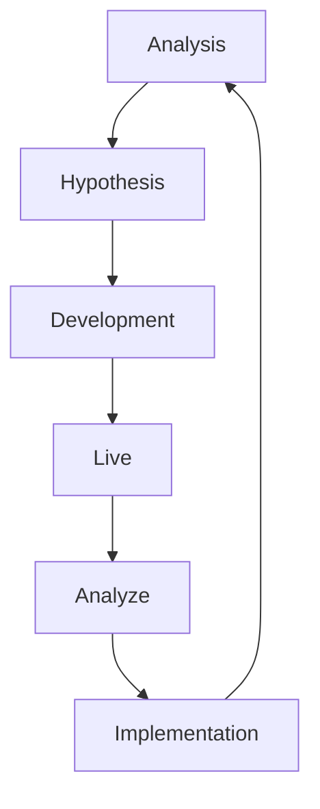

# Experimentation Management System
Manifesting the idea of a centralized Experimentation Management System (ExpMS)  for all sizes of organizations 🪄

## The Problem
May it be client-side or server-side experimentation 🧪, at a certain stretch, it becomes cumbersome to manage tests that your organization is running across all of your public presence/platform because of many reasons not limited to described below:
1. Your Experimentation/Conversion Rate Optimiztion (CRO) Team is scattered across multiple departments and many stakeholders are involved.
2. You're using loads of tools to drive the wagon of experimentation.
3. You're struggling to keep your experimentation team together, resulting in less efficiency and reduced return of investment (ROI) from the tools procured.
4. Scaling up the experimntation culture at your beloved organization becomes a headache as empowering everyone on your mission is challenging.

## The Solution
Defining a efficient solution is the key here as each and every organization is built different and operates in its own fancy way!
> There's no one-perfect soltion or framework definition that works for everyone and everytime but the idea is to manifest a flexible solution while also being efficient 😉

### The Approach
Let's visualize how we wish to revolutionalize the way how experimenting can be managed effortlessly:

